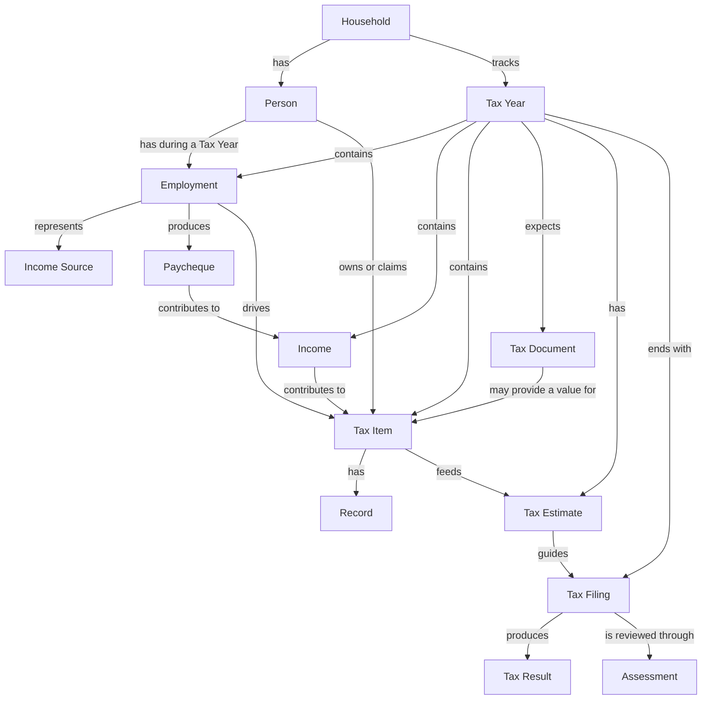

# Domain Model

This document defines the shared language and high-level relationships used throughout Tax Book.

The goal is to keep the model understandable in normal personal-tax language and avoid unnecessary accounting terminology.

## Ubiquitous Language

| Term              | Meaning                                                               |
| ----------------- | --------------------------------------------------------------------- |
| **Household**     | The family unit whose taxes are being tracked                         |
| **Person**        | One individual tax filer in the household                             |
| **Tax Year**      | One calendar year of tax information, such as 2026                    |
| **Income Source** | Where a person earns income from                                      |
| **Employment**    | One person's employment with one employer during a Tax Year           |
| **Paycheque**     | One employer payment received by a person                             |
| **Income**        | Income recorded or projected for a person during a tax year           |
| **Tax Item**      | Anything that matters to the tax return                               |
| **Record**        | Supporting information or evidence the household must retain          |
| **Tax Document**  | An official tax document such as a T4, T5, RRSP receipt, or FHSA slip |
| **Tax Estimate**  | The current estimated refund or amount owing                          |
| **Tax Filing**    | The record of the tax return being submitted                          |
| **Tax Result**    | The refund received or amount owing                                   |
| **Assessment**    | CRA's assessment of the filed return                                  |
| **Note**          | Human context or explanation attached to a tax-related item           |
| **Status**        | The current state of an item or tax year                              |

## Important Distinctions

### Tax Item vs Record

A **Tax Item** represents something that matters to the tax return.

A **Record** supports that Tax Item.

Example:

```text
Tax Item
Medical Expenses

Records
- Dentist: $300
- Glasses: $450
- Prescription: $80
```

The Tax Item represents the tax-relevant total.

The Records explain and support how that total was reached.

---

### Record vs Tax Document

A **Record** is something the household is responsible for keeping as supporting evidence.

Examples:

* medical receipt
* professional expense invoice
* business expense receipt

A **Tax Document** is an official document issued for tax purposes.

Examples:

* T4
* T5
* RRSP contribution receipt
* FHSA tax slip

These are separate concepts because they have different roles in the tax workflow.

---

### Income vs Paycheque

A **Paycheque** is one actual payment.

**Income** represents the broader total or projection for the tax year.

For example:

```text
Income Source
Physiotherapy Clinic

Paycheques
- Jan 16
- Jan 30
- Feb 13
- ...

Income
Actual YTD: $41,200
Projected annual: $68,500
```

Paycheques contribute to Income.

### Employment and Employer Changes

Paycheques belong to an **Employment**, not directly to a Person.

An Employment belongs to one Person and one Tax Year. If a Person changes
employers during the year, each employer is represented by a separate
Employment. This keeps the paycheques, projections, and eventual T4 for each
employer distinct.

Each Employment creates one calculated employment-income Tax Item. Its actual
amount is the sum of recorded gross pay. Its expected amount is the current
projection. These calculated amounts are managed through Paycheques rather than
edited manually on the Tax Item.

---

## Domain Relationships



## Tax Item Behaviour

Not every Tax Item gets its value in the same way.

Examples:

### Manual

The user enters the value directly.

```text
RRSP deduction
$8,000
```

### Aggregated

The Tax Item totals several Records.

```text
Medical Expenses
- Dentist $300
- Glasses $450
- Prescription $80

Total: $830
```

### Income-Based

The value comes from recorded paycheques or another income source.

```text
Employment Income
← sum of paycheque gross amounts
```

### Tax-Document-Based

The value is confirmed by an official Tax Document.

```text
Employment Income
← T4

FHSA
← FHSA tax document
```

### Calculated

Some Tax Items may eventually depend on formulas or other Tax Items.

```text
Tax credit
← income
← household circumstances
← other tax values
```

The application should support these differences gradually.

It does not need a generic tax rules engine in the early phases.

## Household Ownership

Tax information may apply to:

* one Person
* another Person
* the Household

Some items may also involve different roles.

For example:

```text
Medical expense

Patient: Person A
Paid by: Household
Claimed by: Person B
```

These distinctions should only be introduced where they are actually needed.

## Tax Year Lifecycle

A Tax Year moves through a simple lifecycle.

```text
Tracking
→ Preparing
→ Filed
→ Assessed
→ Archived
```

### Tracking

The year is active.

Income, Tax Items, Records, and Tax Documents are still being collected.

### Preparing

The household is reviewing information and waiting for any remaining Tax Documents.

### Filed

The tax return has been submitted.

### Assessed

CRA has issued its assessment.

### Archived

The tax year is considered complete and should behave as a trustworthy historical snapshot.

Historical tax years should not silently change after completion.

If amendments are supported later, they should be handled explicitly.

## Modelling Principles

Prefer plain tax language over accounting terminology.

Prefer one term per concept.

Avoid introducing synonyms such as:

* evidence
* supporting record
* receipt

when they all represent the same domain concept.

Avoid generic concepts such as `Transaction`, `Ledger`, or `Accounting Entry` unless the product genuinely needs them.

Do not design abstractions for future tax rules before a real use case requires them.

The domain should grow from the household's actual tax workflow.
